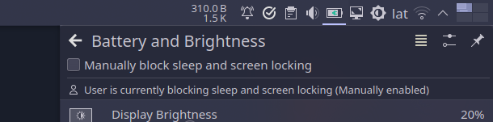

# Manually block sleep and screen locking from commandline or a shortcut
</td>

# Installation
1. Clone/Download the project
2. Copy `pause-auto-sleep` to `/home/YOUR_USERNAME/.local/bin/pause-auto-sleep`
```sh
mkdir -p ~/.local/bin/ && cp pause-auto-sleep ~/.local/bin/pause-auto-sleep
```

3. Make `pause-auto-sleep` executable
```sh
chmod u+x ~/.local/bin/pause-auto-sleep
```

# Usage:
**1. With application_name + reason_for_inhibit:**
```sh
pause-auto-sleep "application_name or desktop.entry.name" "reason for inhibit"
```

To show the app icon and name in the Plasma's Battery and Brightness widget "application_name" should be set to the program name or desktop entry name. To get a program desktop entry name use the following command:
```sh
ls /usr/share/applications .local/share/applications/ | grep -i YOUR_PROGRAM_NAME
```
Example:
```sh
pause-auto-sleep org.kde.konsole "SSH session"
```
**2. Without arguments (Toggle mode):**

When running without arguments:
- application willl be set as "User"
- reason will be set as "Manually enabled"

If the script is run a second time, it will look for existing inhibitor process and stop it, ending the inhibition

Example:
```sh
pause-auto-sleep & # run in background
```
**3. As a shortcut:**

**In KDE Plasma**
1. Go to **System Settings** > **Shortcuts**
2. Click **+ Add command...**
3. Enter `/home/YOUR_USERNAME/.local/bin/pause-auto-sleep` in the command text box (replace YOUR_USERNAME with yours)
4. Click **+ Add**
5. Click **+ Add custom shortcut** in the next view and type your shortcut
6. Hit **Apply**
7. Test your shortcut while looking at the **Batter and Brightness** or **Display Configuration** widget

**Note:** If you're using a version of KDE Plasma older/newer than 2.27.5 those steps may be different

**In GNOME**
1. Go to **Settings** > **Keyboard**
2. Click **View and Customize Shortcuts** under **Keyboard Shortcuts**
3. Click **Custom Shortcuts** > **Add Shortcut**
4. Set a descriptive name
5. Enter `/home/YOUR_USERNAME/.local/bin/pause-auto-sleep` in the command text box (replace YOUR_USERNAME with yours)
6. Click **Set Shortcut...** and type your shortcut
7. Click on **Add**
8. Test your shortcut, this was tested and working in GNOME 43.0, I don't know if there is a visual indicator for this, it there isn't you can test by waiting for your screen to blank (not to blank in this case)

**Note:** If you're using a version of GNOME older/newer than 43.0 those steps may be different

# Demo
https://github.com/luisbocanegra/linux-pause-auto-sleep-and-lock/assets/15076387/e52647a8-067e-42fc-9fcb-2c2d9a1a9986

# Credits & Resources
- Docs
  - [Idle Inhibition Service Draft](https://people.freedesktop.org/~hadess/idle-inhibition-spec/index.html)
    - [org.freedesktop.ScreenSaver — The Idle Inhibition Service manages the inhibition requests. ](https://people.freedesktop.org/~hadess/idle-inhibition-spec/re01.html)

- [gnome-inhibit by @fxthomas](https://gist.github.com/fxthomas/9bdfadd972eaf7100b374042faac28c2)